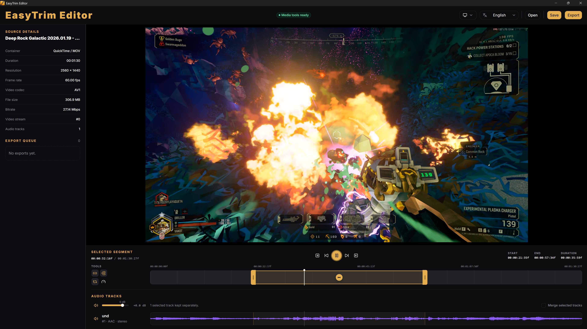

# EasyTrim Editor

EasyTrim Editor is a _fast_, _lightweight_ desktop video trimmer for making precise clips without saving large project files.



## What it does

- Import video files by selecting them or dragging them into the editor.
- Preview the source video with frame-accurate timeline and keyboard controls.
- Trim the beginning and end of a selected segment by dragging its handles.
- Move the whole selected segment without changing its duration.
- Use Shift snapping, safe trim, looping, segment playback, and adjustable playback speed.
- Inspect audio tracks with waveform previews.
- Mute tracks or adjust each track from -24 dB to +6 dB.
- Control overall preview/export volume independently from per-track levels.
- Keep selected tracks separate or merge them into one output track.
- Save a fast cut using stream copying when possible.
- Export an optimized render with resolution, frame-rate, and NVENC preset controls.
- Monitor active and completed renders in the export queue.
- Persist language, theme, and export presets between sessions.

The editor keeps active work in memory only. It does not save projects or restore the current editing session after restart.

## Download

Download the [latest EasyTrim Editor release](https://github.com/vakot/easytrim-editor/releases/latest).

Available release packages:

- Windows x64 NSIS installer (`.exe`);
- Windows x64 MSI installer (`.msi`);
- Linux x64 AppImage;
- Linux x64 Debian package (`.deb`);
- macOS ARM64 disk image (`.dmg`).

FFmpeg is intentionally not bundled. Install FFmpeg and make both `ffmpeg` and `ffprobe` available to the application.

The macOS ARM64 build targets Apple Silicon Macs. Public macOS distribution additionally requires Apple signing and notarization credentials.

## Requirements

Development requires:

- Node.js 22.12 or newer;
- pnpm 11.18.0;
- Rust 1.97.1 through rustup;
- FFmpeg and FFprobe on `PATH`;
- platform-specific Tauri and WebView dependencies.

Windows also requires Microsoft C++ Build Tools with the **Desktop development with C++** workload and Microsoft Edge WebView2.

Linux requires the Tauri system libraries used by the release container, including WebKitGTK, AppIndicator, librsvg, patchelf, and xdg-utils.

macOS requires Xcode Command Line Tools. Homebrew FFmpeg installations in the standard Apple Silicon or Intel locations are supported.

## Quick start

Install dependencies:

```sh
pnpm install --frozen-lockfile
```

Start the desktop app in development mode with Vite hot reload:

```sh
pnpm dev
```

Build the production frontend and native executable for the current operating system:

```sh
pnpm build
```

Preview that production build in the full Tauri application:

```sh
pnpm preview
```

Frontend-only production commands are also available:

```sh
pnpm build:web
pnpm preview:web
```

The frontend-only preview cannot access native FFmpeg or Tauri functionality.

## Quality checks

Run the standard repository checks:

```sh
pnpm check
```

This covers formatting, linting, TypeScript checks, tests, release-script tests, and the production web build.

Native Rust checks can be run separately:

```sh
cargo fmt --all -- --check
cargo check --all-targets
cargo clippy --all-targets --all-features -- -D warnings
cargo test --all-targets
```

## Release artifacts

Release artifacts are built and uploaded manually to avoid consuming GitHub Actions minutes on every small change. GitHub Actions is reserved for the lightweight Linux pull-request build and manually dispatched release jobs.

### Bundle build

Build and upload bundles:

```sh
pnpm release:local -- --tag <tag> --platform <platform>
```

Supported platforms are `windows`, `linux`, `macos-apple-silicon`, and `macos-intel`.

Use `--no-upload` with `--output <directory>` to build local artifacts without uploading them. For example:

```sh
pnpm release:local -- --no-upload --output artifacts/windows --platform windows
```

### Bundle build with Docker

Docker can build Linux x64 artifacts from Windows, macOS, or Linux:

```sh
# Build into artifacts/linux without uploading
pnpm release:linux -- --no-upload

# Build and upload to an existing release
pnpm release:linux -- --tag <tag>
```

Docker Desktop or another Docker daemon with Buildx must be running. The Linux container uses the pinned Node.js, pnpm, and Rust toolchains and does not receive GitHub credentials.

macOS bundles must be built on macOS. Public macOS distribution requires a Developer ID Application certificate and notarization credentials; keep those values in CI secrets and never commit them.

_Release assets use predictable names:_

```text
EasyTrim_<version>_<os>_<arch>_<bundle><extension>
```

Only final installers are uploaded. Build-only files such as `.icns` and `.sh` helpers are excluded.

## Project structure

```text
apps/desktop/
├── src/                 React, TypeScript, and feature modules
└── src-tauri/           Rust native process and Tauri integration
docker/                  Reproducible Linux release build
scripts/                 Development, icon, preview, and release helpers
.github/workflows/       Linux CI and manual release workflows
```

The native layer discovers and runs FFmpeg/FFprobe, handles media inspection and rendering, and exposes typed commands to the React interface. Audio preview, waveforms, fast cuts, and optimized renders are coordinated through this native media layer.

## License

EasyTrim Editor is distributed under the [MIT License](LICENSE).
